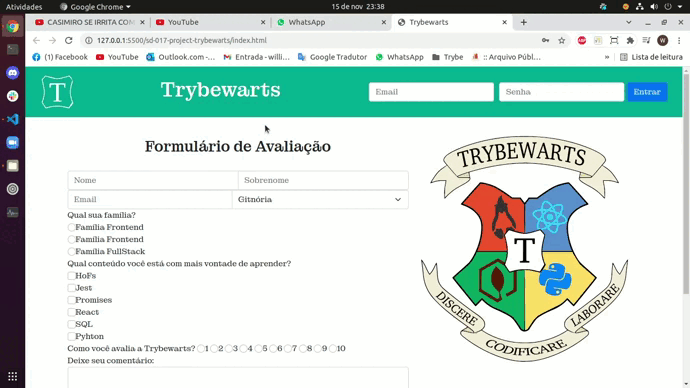

### Observação

Este repositório contem o Projeto Trybewarts que reúne o aprendizado desenvolvido por _[Willian Alves Batista](https://www.linkedin.com/in/willian-alves-batista-60aa6a180/)_ enquanto estudante da [Trybe](https://www.betrybe.com/) :rocket:
GitHub [Trybe](https://github.com/tryber).

# Projeto Lista de Tarefas
### Resultado obtido:

#### Habilidades exigidas:

  - Criar formulários em HTML;
  - Utilizar CSS Flexbox para criar layouts flexíveis;
  - Criar regras CSS específicas para serem aplicadas a dispositivos móveis;
  - Construir páginas que alteram o seu layout de acordo com a orientação da tela.

#### Requisitos obrigatórios:

  - Crie uma barra verde na parte superior da página;
  - Adicione o logotipo da Trybewarts com a classe `trybewarts-header-logo` na barra superior;
  - Acrescente um formulário de login no canto direito da barra superior contendo os inputs de email, senha e um botão de login;
  - Crie um título com o texto `Trybewarts` centralizado dentro do `Header`;
  - Adicione um formulário no corpo da página;
  - Faça com que o eixo principal do formulário seja vertical;
  - Adicione a logo da Trybewarts no lado direito da página;
  - Acrescente ao formulário com id `evaluation-form` os inputs de `nome, sobrenome e email`;
  - Acrescente ao formulário um select com o id `house` contendo as opções `Gitnória`, `Reactpuff`, `Corvinode` e `Pytherina`;
  - Posicione os campos de `Nome` e `Sobrenome` para que fiquem em linha;
  - Posicione os campos de `Email` e `Casa` para que fiquem em linha;
  - Acrescente ao formulário um campo de entrada para qual família a pessoa estudante se identifica;
  - Crie campos de entrada do tipo `checkbox` contendo seis opções;
  - Crie campo de entrada para avaliar de 1 a 10 o nível de satisfação com a Trybewarts;
  - Crie uma textarea com o id `textarea` e uma label com a classe `textarea` contendo o número máximo de caracteres igual à 500;
  - Crie um campo de entrada do tipo `checkbox` com o id `agreement` para validar as informações;
  - Crie um botão de Enviar para submeter o formulário;
  - Faça com que o botão `Enviar` seja habilitado somente após a checkbox do requisito 16 ser selecionada;
  - Crie um rodapé no final da página;
  
### Trybe

_"A Trybe é uma escola do futuro para qualquer pessoa que queira melhorar de vida e construir uma carreira de sucesso em tecnologia, onde a pessoa só paga quando conseguir um bom trabalho."_

